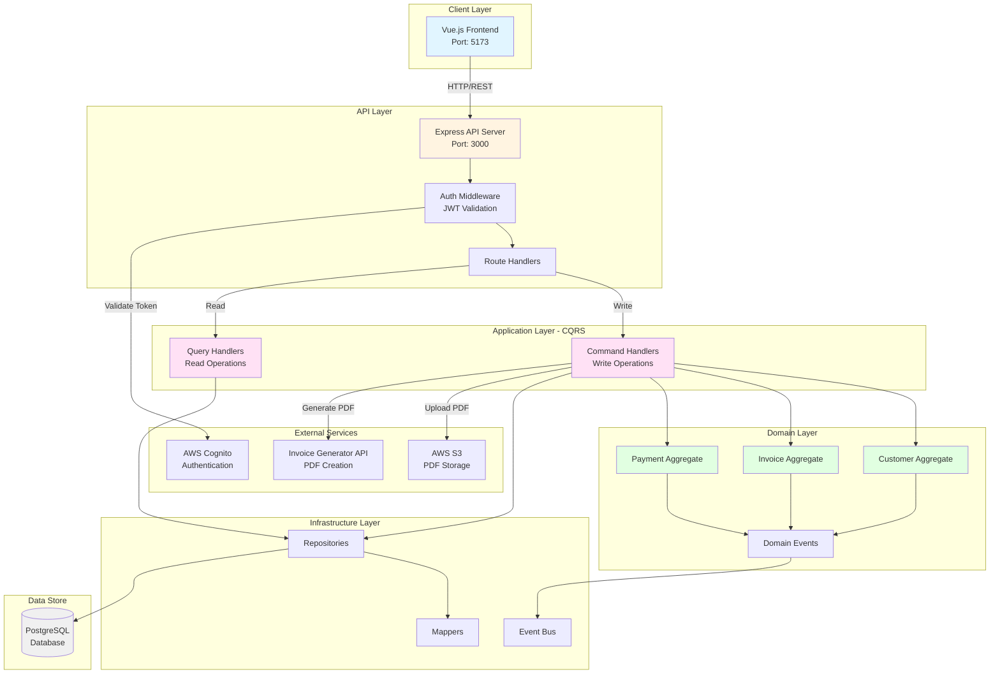
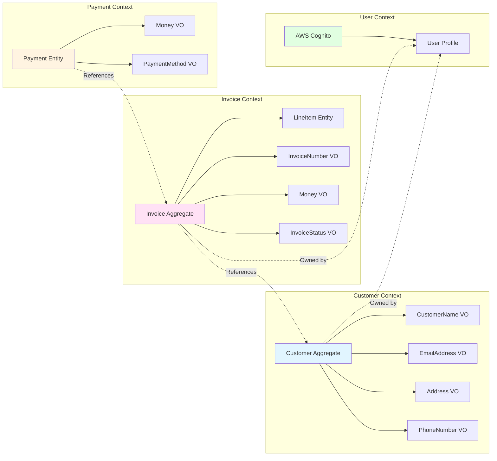
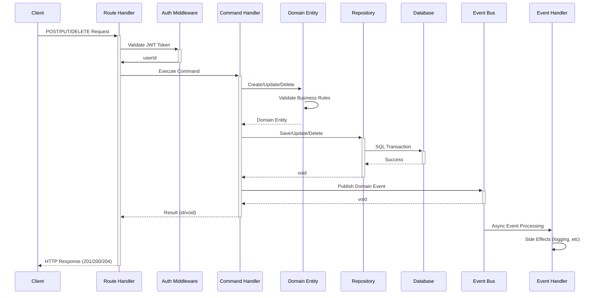
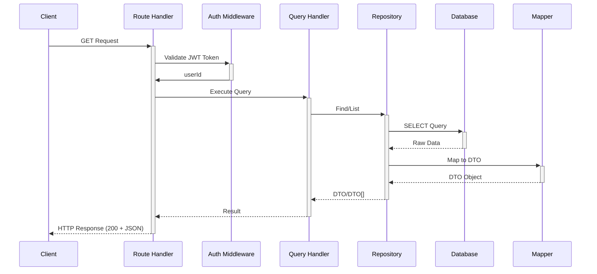
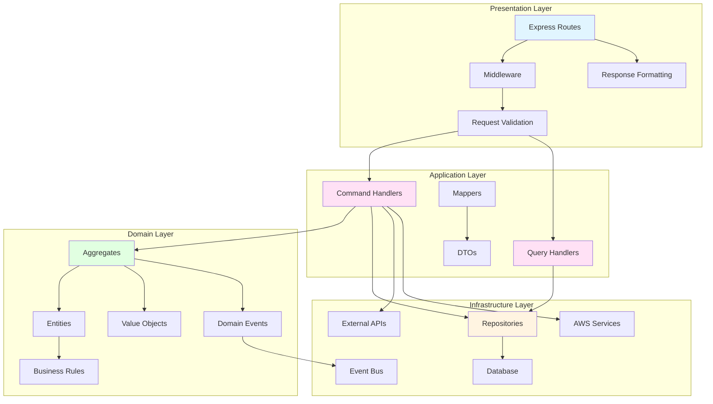

# Architecture Documentation

## Table of Contents
1. [Overview](#overview)
2. [Bounded Contexts](#bounded-contexts)
3. [Domain Model](#domain-model)
4. [Application Layer](#application-layer)
5. [Infrastructure](#infrastructure)
6. [Design Patterns](#design-patterns)
7. [Data Flow](#data-flow)
8. [Event System](#event-system)

## Overview

The Invoice Management System follows **Domain-Driven Design (DDD)**, **CQRS**, and **Vertical Slice Architecture** principles to create a maintainable, scalable application.

### Architectural Goals
- **Separation of Concerns**: Clear boundaries between layers
- **Business Logic Isolation**: Domain logic independent of infrastructure
- **Testability**: Each layer can be tested independently
- **Scalability**: CQRS enables independent scaling of reads/writes
- **Maintainability**: Vertical slices reduce coupling

### System Architecture Overview



## Bounded Contexts



### 1. Customer Context
**Purpose**: Manage customer information and relationships

**Aggregate Root**: Customer

**Entities**:
- Customer (root)

**Value Objects**:
- CustomerName
- EmailAddress
- Address
- PhoneNumber

**Domain Events**:
- CustomerCreated
- CustomerUpdated
- CustomerDeleted

**Invariants**:
- Email must be unique per user
- Customer name required
- Valid email format

---

### 2. Invoice Context
**Purpose**: Handle invoice lifecycle and line items

**Aggregate Root**: Invoice

**Entities**:
- Invoice (root)
- LineItem (child)

**Value Objects**:
- InvoiceNumber
- Money
- InvoiceStatus (Draft, Sent, Paid)

**Domain Events**:
- InvoiceCreated
- LineItemAdded
- LineItemUpdated
- LineItemRemoved
- InvoiceSent
- InvoicePaid
- InvoiceDeleted
- InvoicePDFGenerated

**Invariants**:
- Invoice must have at least one line item before being sent
- Invoice status transitions: Draft → Sent → Paid
- Line items cannot be modified after invoice is sent
- Invoice totals must match line item sums
- Tax calculations accurate to 4 decimal places

---

### 3. Payment Context
**Purpose**: Track payments against invoices

**Aggregate Root**: Payment

**Entities**:
- Payment

**Value Objects**:
- Money
- PaymentMethod (Cash, Check, CreditCard, BankTransfer)

**Domain Events**:
- PaymentRecorded

**Invariants**:
- Payment amount must be positive
- Payment date cannot be in future
- Payment method must be valid

---

### 4. User Context
**Purpose**: User authentication and management

**Integration**: AWS Cognito (external)

**Operations**:
- User registration (Cognito)
- Login/logout (Cognito)
- Token refresh (Cognito)
- User profile management

## Domain Model

### Customer Aggregate

```typescript
class Customer {
  - id: string (UUID)
  - userId: string (owner)
  - name: CustomerName
  - email: EmailAddress
  - address: Address
  - phoneNumber: PhoneNumber
  - deletedAt: Date | null
  - createdAt: Date
  - updatedAt: Date

  + create(props): Customer
  + update(props): void
  + softDelete(): void
  + isDeleted(): boolean
  + toJSON(): object
}
```

**Business Rules**:
- Name: 1-255 characters
- Email: Valid format, unique per user
- Address: All fields required
- Phone: Valid format

---

### Invoice Aggregate

```typescript
class Invoice {
  - id: string (UUID)
  - invoiceNumber: InvoiceNumber
  - userId: string
  - customerId: string
  - companyInfo: string
  - status: InvoiceStatus
  - lineItems: LineItem[]
  - subtotal: Money
  - taxRate: number (0-100)
  - taxAmount: Money
  - total: Money
  - notes: string
  - terms: string
  - issueDate: Date
  - dueDate: Date
  - sentDate: Date | null
  - paidDate: Date | null
  - pdfS3Keys: string[]
  - deletedAt: Date | null

  + create(props): Invoice
  + addLineItem(item): void
  + removeLineItem(id): void
  + updateLineItem(id, props): void
  + calculateTotals(): void
  + markAsSent(): void
  + markAsPaid(): void
  + softDelete(): void
  + getBalance(payments): Money
}
```

**Business Rules**:
- Status transitions: Draft → Sent → Paid (no backwards)
- Must have line items before sending
- Cannot modify after sent
- Tax rate: 0-100%
- Due date >= issue date
- Issue date <= today
- Max 100 line items per invoice

---

### LineItem Entity

```typescript
class LineItem {
  - id: string (UUID)
  - invoiceId: string
  - description: string
  - quantity: number
  - unitPrice: Money
  - amount: Money (calculated)

  + create(props): LineItem
  + update(props): void
  + recalculateAmount(): void
  + toJSON(): object
}
```

**Business Rules**:
- Description: 1-500 characters
- Quantity: > 0
- Unit price: >= 0
- Amount = quantity × unitPrice (rounded to 4 decimals)

---

### Payment Entity

```typescript
class Payment {
  - id: string (UUID)
  - invoiceId: string
  - amount: Money
  - paymentMethod: PaymentMethod
  - paymentDate: Date
  - reference: string (optional)
  - notes: string (optional)
  - createdAt: Date

  + create(props): Payment
  + toJSON(): object
}
```

**Business Rules**:
- Amount: > 0
- Payment date: <= today
- Payment method: valid enum value
- Reference: max 255 chars
- Notes: max 1000 chars

## Application Layer

### Commands (Write Operations)

#### Customer Commands
1. **CreateCustomerCommand**
   - Input: name, email, address, phoneNumber
   - Output: customerId (UUID)
   - Validation: Email uniqueness, format validation
   - Event: CustomerCreatedEvent

2. **UpdateCustomerCommand**
   - Input: customerId, name, email, address, phoneNumber
   - Output: void
   - Validation: Customer exists, not deleted
   - Event: CustomerUpdatedEvent

3. **DeleteCustomerCommand**
   - Input: customerId
   - Output: void
   - Validation: Customer exists, not deleted
   - Event: CustomerDeletedEvent
   - Type: Soft delete

#### Invoice Commands
1. **CreateInvoiceCommand**
   - Input: customerId, companyInfo, issueDate, dueDate, taxRate
   - Output: invoiceId (UUID)
   - Validation: Customer exists, date validation
   - Event: InvoiceCreatedEvent
   - Side effect: Generate invoice number

2. **AddLineItemCommand**
   - Input: invoiceId, description, quantity, unitPrice
   - Output: lineItemId
   - Validation: Invoice in Draft status
   - Event: LineItemAddedEvent
   - Side effect: Recalculate totals

3. **UpdateLineItemCommand**
   - Input: invoiceId, lineItemId, description, quantity, unitPrice
   - Output: void
   - Validation: Invoice in Draft status
   - Event: LineItemUpdatedEvent
   - Side effect: Recalculate totals

4. **RemoveLineItemCommand**
   - Input: invoiceId, lineItemId
   - Output: void
   - Validation: Invoice in Draft status
   - Event: LineItemRemovedEvent
   - Side effect: Recalculate totals

5. **UpdateInvoiceCommand**
   - Input: invoiceId, notes, terms, dueDate
   - Output: void
   - Validation: Invoice exists
   - Event: InvoiceUpdatedEvent

6. **MarkInvoiceAsSentCommand**
   - Input: invoiceId
   - Output: void
   - Validation: Draft status, has line items
   - Event: InvoiceSentEvent
   - Side effect: Set sentDate

7. **MarkInvoiceAsPaidCommand**
   - Input: invoiceId
   - Output: void
   - Validation: Sent status
   - Event: InvoicePaidEvent
   - Side effect: Set paidDate

8. **DeleteInvoiceCommand**
   - Input: invoiceId
   - Output: void
   - Validation: Draft status only
   - Event: InvoiceDeletedEvent
   - Type: Soft delete

9. **GenerateInvoicePDFCommand**
   - Input: invoiceId
   - Output: pdfUrl
   - Validation: Invoice has line items
   - Event: InvoicePDFGeneratedEvent
   - Side effects: API call, S3 upload

#### Payment Commands
1. **RecordPaymentCommand**
   - Input: invoiceId, amount, paymentMethod, paymentDate, reference, notes
   - Output: paymentId
   - Validation: Invoice exists, amount > 0, date <= today
   - Event: PaymentRecordedEvent
   - Side effect: Update invoice paid status if fully paid

### Queries (Read Operations)

#### Customer Queries
1. **GetCustomerQuery**
   - Input: customerId, userId
   - Output: CustomerDTO
   - Filters: userId, not deleted

2. **ListCustomersQuery**
   - Input: userId, page, limit, search
   - Output: CustomerDTO[]
   - Filters: userId, not deleted
   - Pagination: Default 25 items

#### Invoice Queries
1. **GetInvoiceQuery**
   - Input: invoiceId, userId
   - Output: InvoiceDTO (with line items)
   - Filters: userId, not deleted

2. **ListInvoicesQuery**
   - Input: userId, status, page, limit
   - Output: InvoiceDTO[]
   - Filters: userId, status (optional), not deleted
   - Sorting: created_at DESC

3. **GetInvoiceWithPaymentsQuery**
   - Input: invoiceId, userId
   - Output: InvoiceDTO + PaymentDTO[]
   - Filters: userId

#### Payment Queries
1. **GetPaymentQuery**
   - Input: paymentId
   - Output: PaymentDTO

2. **ListPaymentsQuery**
   - Input: invoiceId, page, limit
   - Output: PaymentDTO[]
   - Sorting: payment_date DESC

### DTOs (Data Transfer Objects)

```typescript
// CustomerDTO
{
  id: string;
  userId: string;
  name: string;
  email: string;
  address: {
    street: string;
    city: string;
    state: string;
    postalCode: string;
    country: string;
  };
  phoneNumber: string;
  createdAt: Date;
  updatedAt: Date;
}

// InvoiceDTO
{
  id: string;
  invoiceNumber: string;
  userId: string;
  customerId: string;
  customerName: string; // Denormalized for convenience
  companyInfo: string;
  status: 'Draft' | 'Sent' | 'Paid';
  lineItems: LineItemDTO[];
  subtotal: number;
  taxRate: number;
  taxAmount: number;
  total: number;
  balance: number; // total - sum(payments)
  notes: string;
  terms: string;
  issueDate: Date;
  dueDate: Date;
  sentDate: Date | null;
  paidDate: Date | null;
  pdfS3Keys: string[];
  createdAt: Date;
  updatedAt: Date;
}

// LineItemDTO
{
  id: string;
  invoiceId: string;
  description: string;
  quantity: number;
  unitPrice: number;
  amount: number;
  createdAt: Date;
}

// PaymentDTO
{
  id: string;
  invoiceId: string;
  amount: number;
  paymentMethod: 'Cash' | 'Check' | 'CreditCard' | 'BankTransfer';
  paymentDate: Date;
  reference: string | null;
  notes: string | null;
  createdAt: Date;
}
```

## Infrastructure

### Database Schema

**Tables**:
- users
- customers
- invoices
- line_items
- payments

**Indexes** (for performance):
- `idx_customers_user_id`
- `idx_customers_user_id_email`
- `idx_customers_user_id_deleted_at` (partial index)
- `idx_invoices_user_id`
- `idx_invoices_user_id_status`
- `idx_invoices_user_id_created_at`
- `idx_invoices_customer_id`
- `idx_invoices_invoice_number` (unique)
- `idx_line_items_invoice_id`
- `idx_payments_invoice_id`
- `idx_payments_invoice_id_payment_date`

### External Integrations

1. **AWS Cognito**
   - User authentication
   - Token management
   - User pools

2. **AWS S3**
   - PDF storage
   - Presigned URLs
   - Lifecycle policies

3. **Invoice-Generator.com API**
   - PDF generation
   - Invoice formatting
   - Rate limited (100/month free tier)

## Design Patterns

### 1. Repository Pattern
**Purpose**: Abstract data access

```typescript
interface ICustomerRepository {
  save(customer: Customer): Promise<void>;
  findById(id: string, userId: string): Promise<Customer | null>;
  findByEmail(email: string, userId: string): Promise<Customer | null>;
  list(userId: string, options: ListOptions): Promise<Customer[]>;
  update(customer: Customer): Promise<void>;
  softDelete(id: string, userId: string): Promise<void>;
}
```

### 2. Command Pattern
**Purpose**: Encapsulate operations

```typescript
interface CommandHandler<TCommand, TResult> {
  handle(command: TCommand): Promise<TResult>;
}
```

### 3. Query Pattern
**Purpose**: Read operations

```typescript
interface QueryHandler<TQuery, TResult> {
  handle(query: TQuery): Promise<TResult>;
}
```

### 4. Factory Pattern
**Purpose**: Entity creation with validation

```typescript
class Customer {
  static create(props: CustomerProps): Customer {
    // Validation
    // Value object creation
    // Return new instance
  }
}
```

### 5. Event Bus Pattern
**Purpose**: Decouple event producers and consumers

```typescript
interface IEventBus {
  publish(event: DomainEvent): Promise<void>;
}
```

## Data Flow

### Command Flow (Write)



### Query Flow (Read)



### Layer Architecture



## Event System

### Domain Events

Events are published after successful state changes to enable:
- Audit logging
- Notifications
- Analytics
- Integration with external systems

**Event Structure**:
```typescript
interface DomainEvent {
  eventId: string;
  eventName: string;
  occurredAt: Date;
  payload: Record<string, any>;
}
```

**Event Types**:
1. `customer.created`
2. `customer.updated`
3. `customer.deleted`
4. `invoice.created`
5. `invoice.line_item_added`
6. `invoice.line_item_updated`
7. `invoice.line_item_removed`
8. `invoice.sent`
9. `invoice.paid`
10. `invoice.deleted`
11. `invoice.pdf_generated`
12. `payment.recorded`

**Event Bus Implementation**:
- In-memory event bus for MVP
- Future: External event bus (SNS, EventBridge, RabbitMQ)
- Async processing
- No transactional guarantees (at-least-once delivery)

---

## Performance Considerations

### Database Optimization
- Indexes on frequently queried columns
- Pagination for list operations
- Connection pooling
- Prepared statements

### Caching Strategy (Future)
- Redis for query results
- TTL-based invalidation
- Cache-aside pattern

### Scalability
- Stateless API (horizontal scaling)
- CQRS enables separate read/write scaling
- Event-driven architecture for async operations

## Security

### Authentication
- JWT tokens (Cognito)
- Token expiration (1 hour)
- Refresh token flow

### Authorization
- User-scoped data access (userId filter)
- Repository-level enforcement
- No cross-user access

### Data Protection
- TLS/HTTPS
- Parameterized queries (SQL injection prevention)
- Input validation
- Output sanitization

---

**For implementation guides, see:**
- [CQRS_IMPLEMENTATION.md](./CQRS_IMPLEMENTATION.md)
- [CQRS_SETUP_GUIDE.md](./CQRS_SETUP_GUIDE.md)
- [SECURITY_AUDIT.md](./SECURITY_AUDIT.md)
- [PERFORMANCE_IMPROVEMENTS.md](./PERFORMANCE_IMPROVEMENTS.md)


