# InvoiceMe - System Architecture Diagrams

## 1. High-Level System Architecture

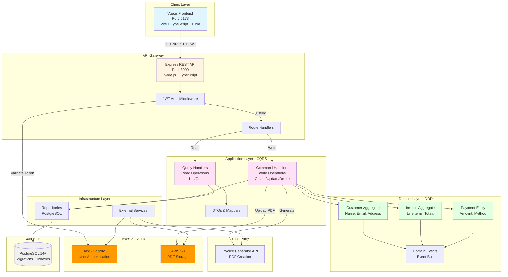

## 2. Bounded Contexts & Domain Model

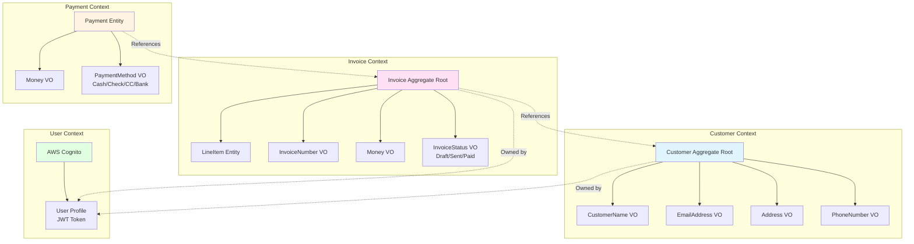

## 3. CQRS Command Flow (Write Operations)

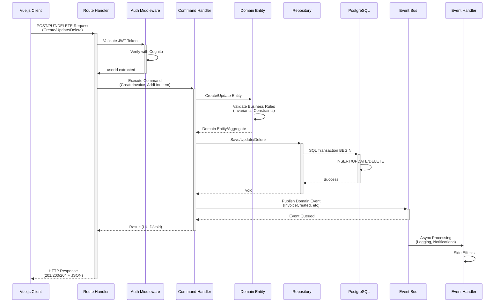

## 4. CQRS Query Flow (Read Operations)

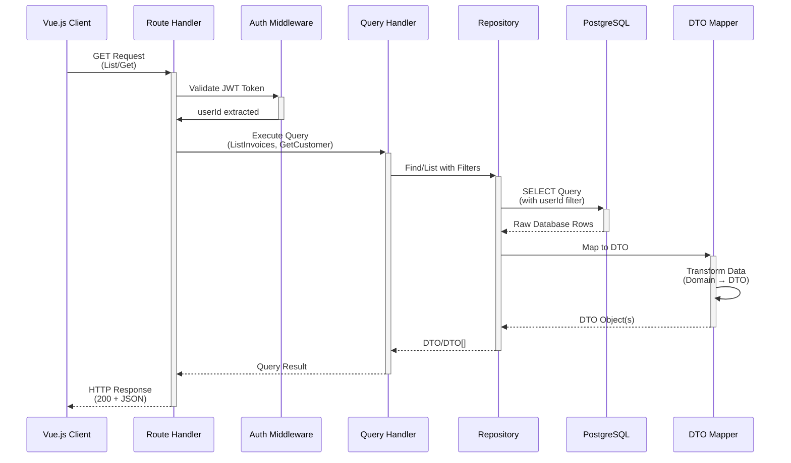

## 5. Layered Architecture

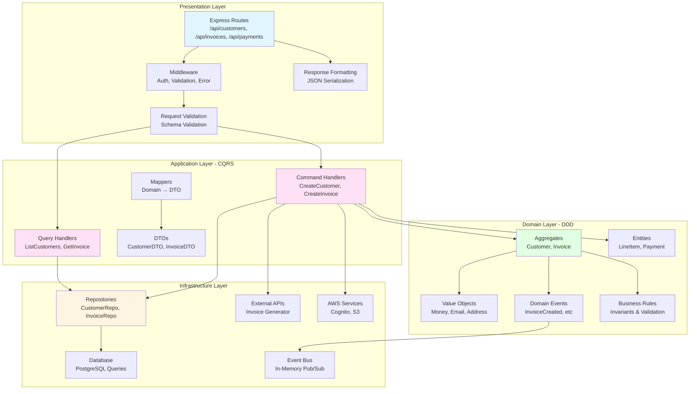

## 6. Frontend Architecture

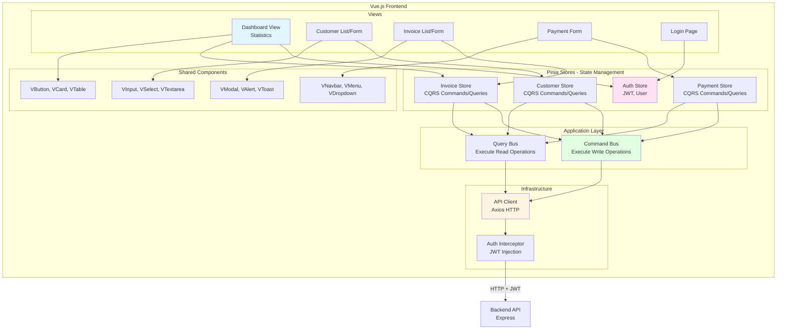

## 7. Database Schema

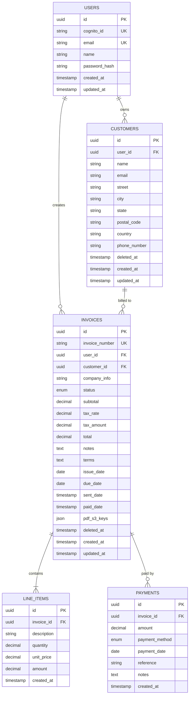

## 8. Event System

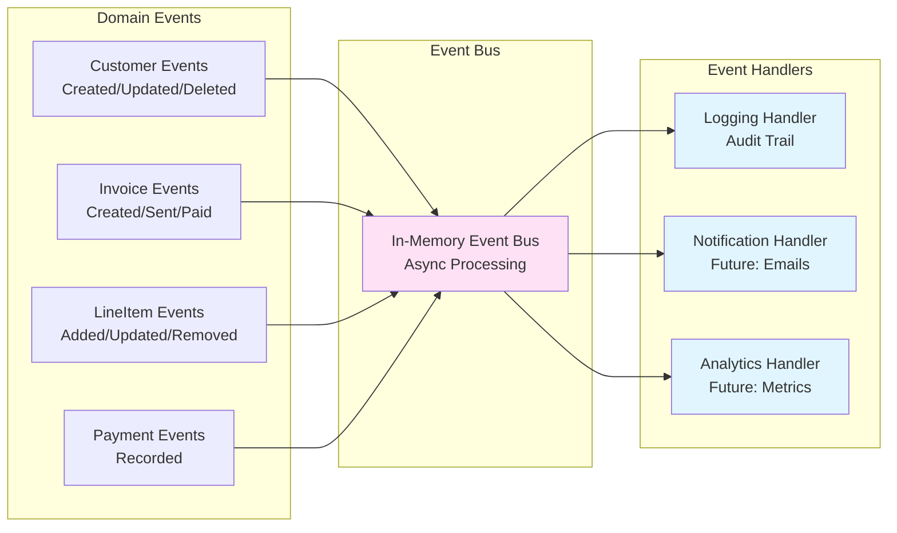

## 9. Invoice Lifecycle

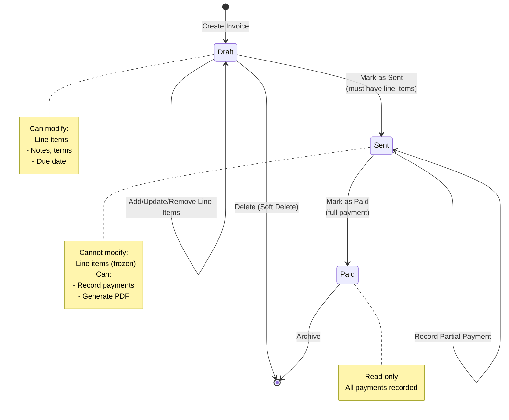

## 10. API Endpoints

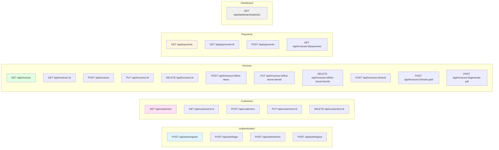

## 11. Deployment Architecture (Production)

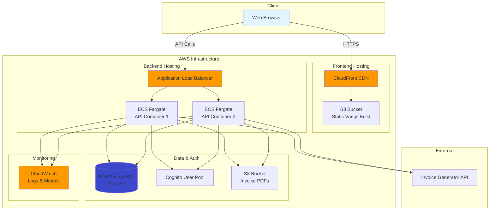

## 12. Security Architecture

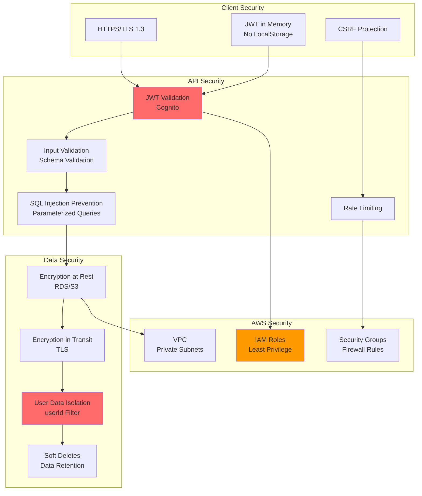

## Architecture Summary

### Key Architectural Patterns
1. **Domain-Driven Design (DDD)**: Bounded contexts with rich domain models
2. **CQRS**: Separate command/query handlers for read/write optimization
3. **Vertical Slice Architecture**: Feature-based organization
4. **Repository Pattern**: Abstract data access
5. **Event-Driven Architecture**: Domain events for side effects

### Technology Stack
- **Frontend**: Vue.js 3 + TypeScript + Vite + Pinia
- **Backend**: Node.js + TypeScript + Express
- **Database**: PostgreSQL 14+ with migrations
- **Auth**: AWS Cognito (JWT)
- **Storage**: AWS S3
- **PDF**: Invoice Generator API
- **Deployment**: AWS (ECS Fargate, RDS, CloudFront)

### Bounded Contexts
1. **Customer Context**: Customer management
2. **Invoice Context**: Invoice lifecycle + line items
3. **Payment Context**: Payment tracking
4. **User Context**: Authentication (AWS Cognito)

### Performance Features
- Database indexes on frequently queried columns
- Pagination for list operations
- Connection pooling
- CQRS enables read/write scaling
- CDN for static assets

### Security Features
- JWT authentication with AWS Cognito
- User data isolation (userId filtering)
- Parameterized queries (SQL injection prevention)
- TLS/HTTPS encryption
- Input validation
- Rate limiting

